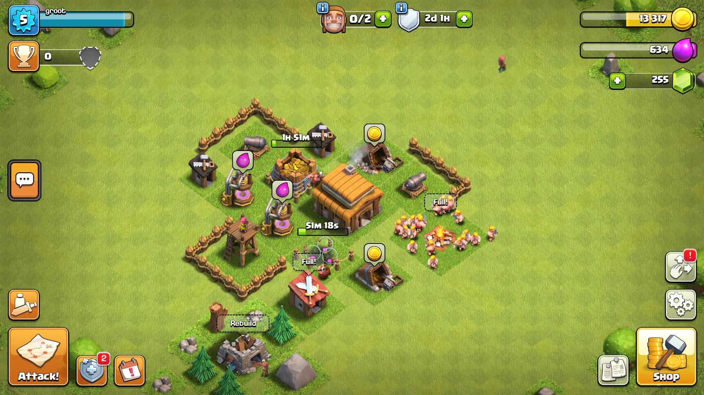
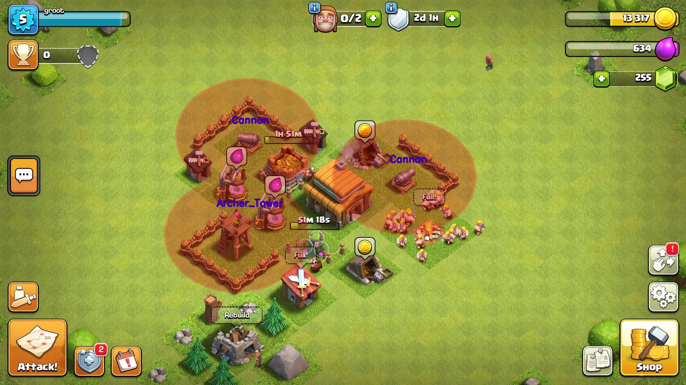

# Defense Range Visualizer

Defense Range Visualizer is a project that detects defense systems and visualizes their range. This project uses YOLOv8 and OpenCV to detect defense systems and marks their ranges visually.
## Sample Output

## Features
- **Defense Systems Detection:** Detects defense systems using a custom YOLOv8 model.
  
- **Range Visualization:** Visualizes the range of detected defense systems.

- **Management of Confidence Scores:** Skips detections with low confidence scores and shows only high-confidence detections.

- **Image Processing and Display:** Saves and displays the processed image using image processing techniques.

## Dataset and Model Training

1. **Dataset Creation:**
   - Collect images of defense systems to create a dataset.

2. **Labeling:**
   - Label images using [MakeSense](https://www.makesense.ai/).

3. **Model Training:**
   - Train the model using YOLOv8. The trained model file (`best.pt`) is used in the project.

## Requirements

- Python 3.x
- OpenCV
- Ultralytics YOLOv8
  
## Contributing

If you would like to contribute, please submit a pull request or open an issue. I welcome any contributions and feedback!
